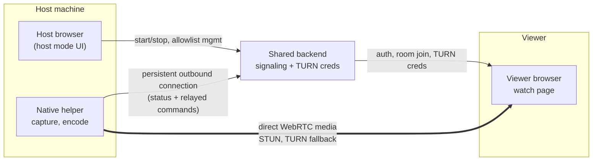

# golive — Native AV1 Broadcast Host

## 1. What this is

A low-latency, zero-cost, small-audience (≤10 viewers) live streaming tool.

- **Viewer**: a web page (`golive.puhl.dev/watch/{roomId}`)  .
- **Host UI**: the *same* web frontend as the viewer (no separate app to build), with a
  "host mode" that unlocks once a native helper is detected as connected — see §3.
- **Native helper**: a small, headless background process (no GUI, not a Tauri app) that
  does the actual screen capture and AV1 encoding, and fans a single encode out to each
  connected viewer directly (mesh — see §3 for why no SFU is used).
- **Transport**: WebRTC mesh — helper connects directly to each viewer. NAT traversal
  uses STUN first, then falls back to TURN.
- **TURN is host-provided** — each host can brings/owns their own TURN
  credentials rather than relying on a shared third-party quota. Access to those
  credentials is gated by a per-host allowlist of permitted viewer IDs. If there 
	no turn and viewer cant see the host screen with public available STUN servers,
	show a clear error. No Fallback

- **Auth**: Discord OAuth — used both for room/signaling identity and as the identity
  checked against a host's TURN allowlist.

Codec scope for v1: **AV1 only**. No fallback codec, no transcoding.

## 2. Constraints (don't violate these)

- **$0 infrastructure cost**, and no shared quota that scales badly as more people run
  this — each host supplies their own TURN relay, so cost/capacity is distributed per
  host rather than centralized.
- No self-hosted signaling or TURN server run *from the host's own machine*, since the
  operator's router blocks inbound connections — anything that needs a public IP
  (signaling, TURN) runs on a small always-reachable service the host deploys
  ( a small VPS).
- **No direct browser-to-localhost communication.** The host browser and the native
  helper run on the same machine but must never call each other directly. This is
  deliberate: it sidesteps Chrome's evolving Local Network Access / Private Network
  Access restrictions (a permission layer specifically targeting public HTTPS pages
  calling `localhost`/private-network addresses, currently being rolled out and still
  changing) entirely, rather than building against a moving target.
- ≤10 concurrent viewers per room. Do not over-engineer for scale beyond this.
- Host machine may be behind an arbitrary home NAT; assume no port forwarding, no
  static IP, no UPnP guarantee — this is exactly what TURN exists to solve.
- **Accepted tradeoff**: since there is no SFU, the host's *upload* bandwidth must
  support roughly `bitrate × concurrent viewer count`. Consider surfacing an estimated
  required upload bandwidth in the host UI based on chosen quality × viewer cap.

## 3. Architecture

Note what's *not* there: no line between "Host browser" and "Native helper" — despite
running on the same machine, they never talk to each other directly. Both only ever
connect outward to the shared backend, which relays control commands between them. This
is the mechanism that avoids browser-to-localhost calls entirely (see §2).

### Why no SFU

An SFU solves two distinct problems, only one of which still applies here:

1. **Single encode instead of one encode per viewer** — solved without an SFU, since the
   native helper encodes once and duplicates the already-encoded RTP packets across each
   outgoing peer connection (no per-viewer re-encoding).
2. **Single upload instead of one upload per viewer** — an SFU is the only thing that
   removes this, since TURN only relays what it's given; it doesn't multiply it. Without
   an SFU, the helper's upload bandwidth genuinely scales with viewer count. **This is
   the one tradeoff we're accepting**, in exchange for not depending on a shared
   external relay/quota.

If this ever becomes a real problem (helper's upload insufficient for the desired
viewer count/quality), reintroducing an SFU is the fix — flag as a possible v2
direction, not needed now.

## 4. Components

### 4.1 Host browser (UI)
No separate app to build here. The same frontend that serves `watch/{roomId}` gains a
"host mode":
1. After login, ask the shared backend whether a native helper is currently connected
   for this account (see §4.3 — the backend already knows, since the helper maintains a
   persistent connection to it).
2. If connected, unlock host controls: pick capture source, manage the viewer allowlist,
   start/stop, show the room link, live bandwidth/quality indicator.
3. Every control action is a normal API call to the shared backend (same pattern already
   used for room state) — the backend forwards it to the helper over the existing
   persistent connection. The browser never calls the helper directly.
4. If no helper is connected, show a prompt to download/run it, with no host controls.

### 4.2 Native helper

Headless background process — no GUI window required (a system tray icon for user
comfort is optional, but there's no webview to bundle, so this is not a Tauri app).

Responsibilities:
1. On startup, open a persistent outbound connection (e.g. a WebSocket) to the shared
   backend and authenticate as this host's helper. This connection is both the presence
   signal ("helper is online") and the control channel (receives start/stop/pick-source
   commands relayed from the host browser).
2. Let the backend-relayed commands drive capture source selection.
3. Encode captured frames as AV1, in real time, **once**.
4. Open one WebRTC peer connection per connected viewer, feeding each the **same**
   already-encoded stream (no per-viewer re-encoding) — a `tee` feeding N outgoing
   connections.
5. For each peer connection, use ICE servers = STUN (free, public) + credentials
   obtained via the credential API (see §4.3) as TURN fallback.
6. Enforce the viewer allowlist (reject peer connection attempts from IDs the host
   hasn't approved) — the allowlist itself is managed from the host browser via the
   backend, not locally.

Suggested implementation:
- **Capture + encode**: GStreamer pipeline.
  - Capture: platform-specific source (`d3d11screencapturesrc`/`dxgiscreencapsrc` on
    Windows, `ximagesrc`/`pipewiresrc` on Linux, `avfvideosrc` on macOS).
  - Encode: try a hardware AV1 encoder first if present (`nvav1enc`, `qsvav1enc`,
    `vaapiav1enc`, or platform equivalent), fall back to `svtav1enc` (software,
    real-time tunable) if none is available.
  - Fan-out: `tee` element feeding N `webrtcbin` instances (one per viewer), each with
    its own ICE configuration — avoids re-encoding per branch.
- **Packaging**: a plain Rust or Go binary is sufficient (single static executable,
  cross-platform, no webview/runtime to bundle). Windows first, since that's most likely
  for screen/game capture; Linux/macOS as stretch.
- Verify current GStreamer element names/plugins against current docs before relying on
  the ones listed above — this area moves.

### 4.3 Host-owned services

Two small pieces the host runs somewhere always-reachable (not on their own blocked-router
machine) — a free-tier VM, a Worker, a small always-on box, whatever's convenient per host:

- **TURN server** (e.g. `coturn`), configured with the REST API / shared-secret mode so
  credentials are time-limited and derived rather than static.
- **Credential API**: authenticated endpoint (viewer must already be logged in via the
  shared Discord OAuth flow) that:
  1. Checks the requesting viewer's Discord ID against this host's allowlist.
  2. If permitted, derives a short-lived TURN username/password from the shared secret
     and returns it, plus the TURN server's address.
  3. Rejects anyone not on the allowlist.

This is deliberately small and stateless (aside from the allowlist) — no media ever
touches it, only credential issuance.

### 4.4 Shared signaling and control relay

Can remain a single centralized service , since it carries no
media, just:
1. Discord OAuth login → session/identity.
2. Room creation and lookup (`roomId` → which host, which credential-API endpoint to hit).
3. SDP offer/answer and ICE candidate relay between helper and each viewer.
4. **The persistent connection from each native helper** (presence + control relay), and
   the corresponding API the host browser calls to issue commands to its own helper.

Because this never carries media, it stays cheap and shareable across many hosts/rooms
without anyone's usage crowding anyone else out.

## 5. Suggested build order

1. **Shared signaling skeleton**: Discord OAuth + room creation + SDP/ICE relay. Test
   using the existing browser-based host/viewer before touching native code.
2. **Persistent connection + control relay**: add the helper-presence WebSocket endpoint
   and the host-browser-facing command API, using a stub helper (no real capture/encode
   yet) to prove the "no direct browser-to-helper call" pattern end to end.
3. **Credential API + TURN server**: I will use cloudflare TURN credential, but a user may
	use coturn or something. So do not overbuild for cotorn.
   always-reachable, plus the allowlist-checking credential endpoint.
4. **Real native helper MVP**: capture + software AV1 encode (`svtav1enc`) + one peer
   connection to one viewer, using STUN + the mandatory TURN, driven by real commands
   from the host browser via the relay built in step 2.
5. **Multi-viewer fan-out**: extend to N peer connections from a single encode (`tee`),
   test up to the real target of ~10 viewers, and measure actual upload bandwidth usage
   against the host's real connection.
6. **Hardware encoder path**: detect and prefer a hardware AV1 encoder when available.
7. **Allowlist UX + polish**: host-side UI for managing permitted viewers, room link UX,
   reconnect handling, capture source picker, bandwidth/error indicators.

## 6. Open questions to resolve before/while building

- Exact protocol for the persistent helper↔backend connection (WebSocket is the obvious
  default) and its reconnect/backoff behavior if the helper's network blips.
- Where does each host actually run their credential API + coturn? A documented
  "one-click" deploy target (e.g. a free-tier Fly.io/Oracle Cloud VM) would keep this
  from becoming the new friction point that used to be "download an executable."
- Exact current GStreamer fan-out element names — verify against `gst-plugins-rs` and
  core GStreamer docs at build time.
- What happens when a viewer's ID isn't on the allowlist — silent room-join failure,
  or an explicit "ask the host for access" flow?
- What's the actual bandwidth/quality ceiling to design the UI around, given the
  accepted host-upload-scales-with-viewers tradeoff? 

## 7. Explicit non-goals for v1

- No codec other than AV1.
- No support for viewers beyond modern Chromium-based browsers (Safari/iOS AV1 support
  is unreliable — out of scope for now).
- No recording/DVR functionality.
- No mobile host app.
- No SFU (see §3 for why, and the note on revisiting this if helper upload bandwidth
  becomes a real limiting factor).
- No native GUI / Tauri wrapper, and no browser-to-localhost calls of any kind — host
  controls live entirely in the shared web frontend, relayed through the backend.
